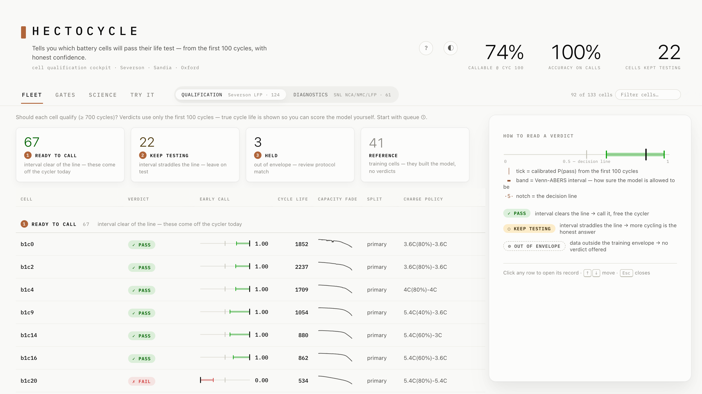
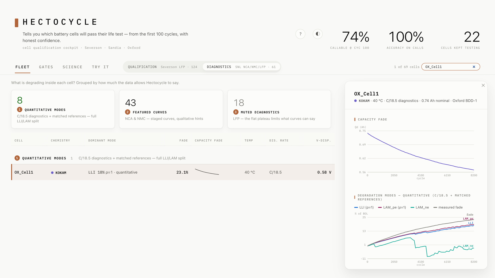
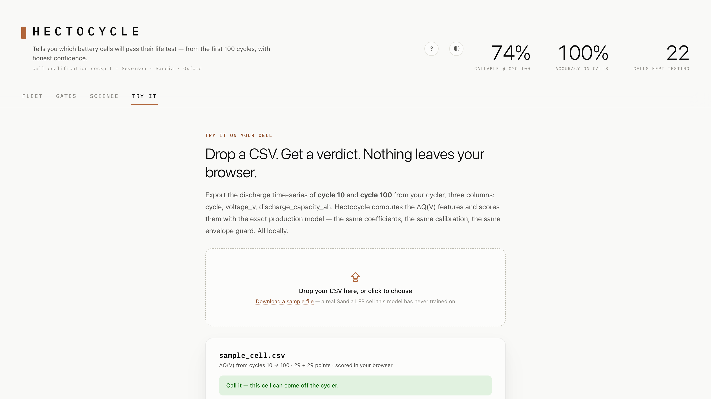

# Hectocycle

*Hecto-: the SI prefix for one hundred. One hundred cycles in, Hectocycle makes the call.*

A cockpit for cell qualification triage: **call pass/fail early — with honest confidence — or say "keep testing,"** plus chemistry-aware degradation diagnostics. Built gate-first: every feature shipped here survived a pre-registered falsifiable gate, and the validation studies in `docs/` document exactly where the methods break — and what it took to earn them back.

**[▶ Live demo](https://hectocycle.com)** — no install; runs on the precomputed bundle.

 



*The fleet as a triage inbox: queue cards summarize who can come off the cyclers today; every early call is a probability rail with its Venn-ABERS interval, and a straddled decision line means an explicit KEEP TESTING — honest uncertainty as the visual identity.*



*Degradation-mode attribution, earned tier by tier: with C/18.5 diagnostics and chemistry-matched half-cell references, the full LLI / LAM_pe / LAM_ne split passes the pre-registered stability gate on 8/8 cells (ρ = 1.00). Cells with only 0.5C data get a qualitative hint instead — the UI never shows a number the gate didn't earn.*



*Drop a CSV of cycles 10 and 100, get a verdict scored entirely in the browser by the exported production model (parity-tested to 1e-6 against the Python pipeline). Nothing is uploaded anywhere.*

## What's inside

| Study | Question | What ships |
|---|---|---|
| [Early call](docs/early-call-study.md) | Can ≤100-cycle data flip a qualification verdict reliably? | Calibrated P(pass) + Venn-ABERS interval + abstain rule. Production model uses **protocol-invariant ΔQ(V) features only** — the full feature set transfers 0/9 across labs, ΔQ-only transfers 9/9 — plus an out-of-envelope input guard |
| [Degradation modes](docs/degradation-modes-study.md) | Can 0.5C diagnostics support LLI/LAM attribution on NCA/NMC? | ICA/DVA curve tracking + fade-closure QC; mode split shown as a hint with its stability score — NCA decomposition is genuinely unidentifiable from 0.5C data (documented, not hidden) |
| [Mode identifiability](docs/mode-identifiability-study.md) | What earns quantitative modes back? | Three-tier answer on Oxford BDD-1 (C/18.5 pseudo-OCV): generic refs → LLI/LAM_pe stable (8/8, 6/8); **matched half-cell refs → full three-way split passes the pre-registered bar 8/8** |
| Browser scoring | Can you try it on your own cell? | **TRY IT tab**: drop a CSV of cycles 10 & 100, get a verdict scored entirely in the browser — the exported model matches the Python pipeline to 1e-6 (parity-tested), envelope guard included |

## Chemistry targeting

The datasets mirror a Tesla-relevant chemistry portfolio: **NCA** (Panasonic NCR18650B — the 18650/2170 workhorse family), **NMC** (LG HG2, LiNi0.84Mn0.06Co0.10 — the 2170/4680 family), and **LFP** (A123 — the CATL-sourced base-trim family). The engine is chemistry-aware by design: it quantifies *why* LFP diagnostics are muted (capacity moves in a 0.16 V band vs 0.5–0.6 V for the nickel chemistries) rather than pretending one method fits all. A natural extension is Dahn-lab-lineage NMC data — Dalhousie's published degradation-analysis methods are the reference point for the electrode-alignment approach used here.

## Data

- **Severson/MATR** (124 LFP cells, early-life prediction): `data.matr.io` (open at time of writing; exact file URLs in `src/data.py`)
- **Sandia/SNL** (61 NCA/NMC/LFP cells, Preger et al. 2020, double-attribution license): BatteryLife processed mirror, [Zenodo 19688272](https://zenodo.org/records/19688272) → `SNL.zip` → `data/snl/SNL/`
- **Oxford BDD-1** (8 Kokam pouch cells, C/18.5 pseudo-OCV diagnostics, Birkl & Howey 2017): [ORA](https://ora.ox.ac.uk/objects/uuid:03ba4b01-cfed-46d3-9b1a-7d4a7bdf6fac) → `data/oxford/` (optional; the bundle builder skips the Oxford fleet if absent)
- Half-cell OCP references vendored in `refs/ocp/` from PyBaMM parameter sets (Chen 2020, Kim 2011, Ecker 2015, Afshar 2017) and SLIDE's matched Kokam curves — all BSD-3, attribution in `LICENSE` and `src/ocp_refs.py`

## Run it

```bash
python -m venv .venv && .venv/bin/pip install -r requirements.txt
# place datasets per above, then:
.venv/bin/python scripts/build_bundle.py      # precompute cockpit_data.json (~4 min)
.venv/bin/uvicorn app.main:app --port 8377    # open http://127.0.0.1:8377
```

The frontend is a no-build static SPA; `app/static/` also works on any static host.

Study notebooks: `notebooks/early_call_study.ipynb`, `notebooks/degradation_modes_study.ipynb` — each runs top-to-bottom on a fresh checkout and prints its result.
